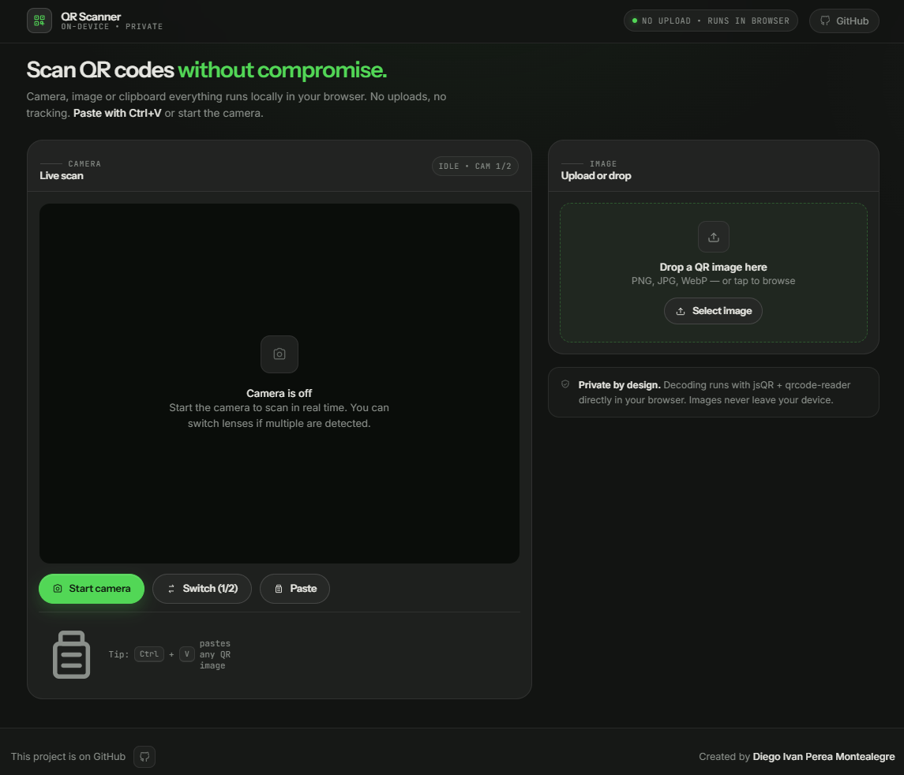
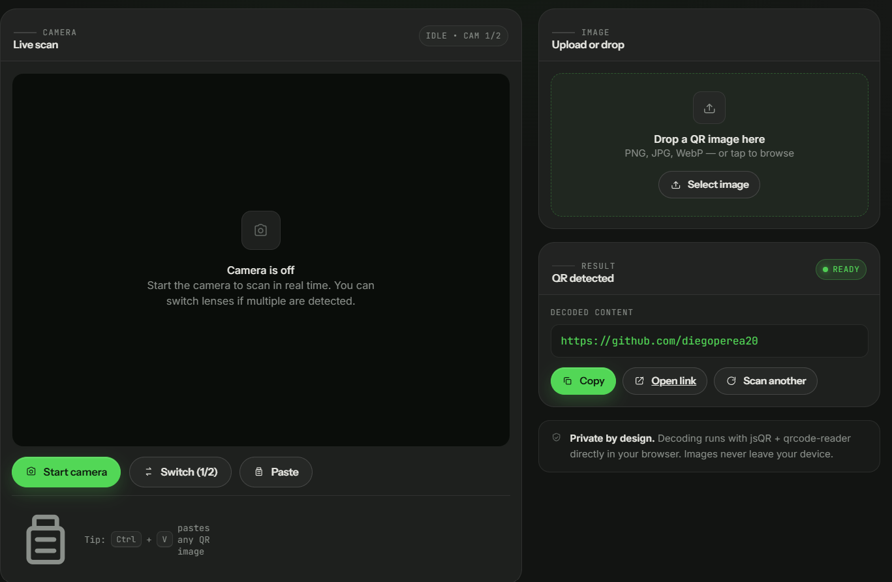

# Qr Scanner 

<p align="justify">
Qr Scanner where you can scan with the camera (change camera) and be redirected to the scanned url and shown the url. Or you can also select the file or drag the file and be redirected to the scanned url and shown the url.
</p>


<p align="center">
  
</p>


<p align="center">
  
</p>


<p align="center">
  
</p>


-----

Fronted Nextjs Options for do it:

This is a [Next.js](https://nextjs.org/) project bootstrapped with [`create-next-app`](https://github.com/vercel/next.js/tree/canary/packages/create-next-app).

## Getting Started
Nodejs version v20.10.0 and Next.js version v14.2.3 

First
```bash
npm install
```
run the development server:

```bash
npm run dev
# or
yarn dev
# or
pnpm dev
# or
bun dev
```

Open [http://localhost:3000](http://localhost:3000) with your browser to see the result.

---

## 🔧 QR Scanner CLI

A command-line tool that decodes QR codes from image files using the same
pipeline as the web app (`jsqr` first, falling back to `qrcode-reader`).
It is ideal for agents and automation.

### Usage

```bash
node cli/index.js <image-path> [more images...] [--json]
```

Or via the npm script:

```bash
npm run qrscan -- <image-path>
```

### Examples

```bash
# Single file
node cli/index.js README-images/github-qr.png

# Multiple files
node cli/index.js qr1.png qr2.jpg

# Machine-readable JSON output (best for agents)
node cli/index.js qr1.png --json
```

### Output

- Decoded results are printed to stdout: `path: result`
- Errors / "not detected" messages go to stderr.
- With `--json`, a structured array is printed instead:
  `[{"file": "...", "ok": true, "result": "...", "decoder": "jsqr"}]`

### Exit codes

| Code | Meaning                                    |
| ---- | ------------------------------------------ |
| 0    | All files decoded successfully             |
| 1    | At least one file failed or had no QR code |
| 2    | No image paths were provided (usage error) |

Supported formats: PNG, JPEG, BMP, GIF, TIFF.
See [`cli/README.md`](cli/README.md) for details.

---

## Resolve : Error Nextjs Parsing error: Cannot find module 'next/babel'

Put this code in .eslintrc.json 
```bash
{
  "extends": ["next/babel","next/core-web-vitals"]
}
```

### 📄 License

This project is licensed under the MIT License - see the [LICENSE](LICENSE) file for details.

---

## 👨‍💻 Author / Autor

**Diego Ivan Perea Montealegre**

- GitHub: [@diegoperea20](https://github.com/diegoperea20)

---

Created by [Diego Ivan Perea Montealegre](https://github.com/diegoperea20)